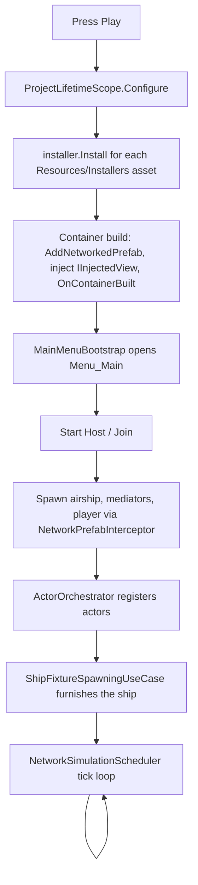

# Architecture Overview

The why behind the structure. For where things are, see [`CODE_MAP.md`](CODE_MAP.md); for how to build on it,
[`TUTORIAL_NEW_FEATURE.md`](TUTORIAL_NEW_FEATURE.md) and [`TASK_GUIDES.md`](TASK_GUIDES.md).

## Core Pillars

TinCan is built on a few technical pillars designed to make multiplayer development scalable and modular:

### 1. Dependency Injection (VContainer)
We use [VContainer](https://vcontainer.hadashikick.jp/) as our DI framework.
- **No Singletons:** Avoid using `Instance` patterns. Inject dependencies via constructors or standard VContainer `[Inject]` attributes on MonoBehaviours.
- **ProjectLifetimeScope:** Found in `Core/Infrastructure/ProjectLifetimeScope.cs`. This is the composition root where core services, registries and NGO services are bound, and where every `FeatureInstaller` asset is asked to register its feature.
- **Entry Points:** We heavily utilize `IInitializable`, `ITickable`, and UseCases bound via `builder.UseEntryPoints(...)`.
- **Constructor selection:** VContainer picks the constructor with the most parameters. A class with a test-only overload must mark the production constructor `[Inject]`.

### 2. Networking (Netcode for GameObjects - NGO)
All multiplayer synchronization runs through Unity's official Netcode for GameObjects.
- **Naming Convention:** All components that inherit from `NetworkBehaviour` MUST be suffixed with `NetworkMediator` (e.g., `AbilityNetworkMediator`, not `AbilityController`).
- **NetworkMediators:** MonoBehaviours that act as the authoritative bridge. Logic should be separated into pure C# `UseCase` or `Processor` classes, while the Mediator handles the RPCs and `NetworkVariables`.
- **Prefab Spawning:** Controlled strictly via VContainer's `AddNetworkedPrefab` extension, which pairs a prefab with a `NetworkPrefabInterceptor` so instances are injected on every peer before NGO's spawn callbacks. Core prefabs (player, airship, possession and build mediators) are wired in `ProjectLifetimeScope`; feature prefabs are listed by their installer.

### 3. Simulation & Synchronization Paradigms
To maintain a responsive FPS experience, we follow an **Input-Driven Simulation** paradigm:
- **Input-Driven Simulation (Input Sync):** Primary for movement and time-critical actions. Clients capture intent as an `InputState`. Both Client (Prediction) and Server (Authority) execute the same Use Case logic using this input stream.
- **Decoupled Prediction Loop:** UseCases that own a simulation loop (e.g., `HumanoidMovementUseCase`) are strictly responsible for passing their predicted `InputState` to auxiliary systems (like `AbilitySystemUseCase.ProcessAbilitySimulation`). Global systems must check `actor is ISimulatedActor` and skip global ticking for actors that handle their own prediction, guaranteeing that simulation physics and abilities share the exact same temporal tick.
  The current airship is a legacy exception: `Assets/Scripts/Features/Airship/AirshipMovementUseCase.cs` does not tick GAS. Its separate `Assets/Scripts/Network/Infrastructure/Abilities/AbilityNetworkMediator.cs` is not an `ISimulatedActor`, so `AbilitySystemUseCase.Tick` still updates that controller globally. Moving ship abilities into prediction requires changing both paths together to preserve one ticking owner.
- **State-Driven Synchronization (State Sync):** The server is the source of truth for high-level state changes (Tags, Attributes, Inventory). Mediators sync these back to clients via `NetworkVariable` or `ClientRpc` for visual confirmation.
- **Avoid Side-Channels:** Do not use independent `ServerRpc` calls for actions that are part of the core simulation loop (like ability triggers or jumping). These should be bits in the `InputState` to ensure they are processed at the correct simulation tick.

### 4. Possession & Interaction Flow
The game relies heavily on dynamic possession (e.g., leaving a humanoid body to fly a free-camera, or boarding an airship).
- **IPossessable:** Implemented by entities that can be owned by a player (e.g., Humanoid, Airship).
- **Possession authority:** `ServerPossessionManager` (`IPossessionAuthority`) assigns ownership on the server; `PossessionUseCase` (`IPossessionState`) is the client-side view; `PossessionNetworkMediator` carries the RPCs.
- **InteractivityUseCase:** A global `ITickable` that listens for the Interact input. It uses an `IInteractorRegistry` to find what the player is looking at, and routes the request through the requester's `NetworkMediator` to the server-side `InteractionOrchestrator`, which picks the `IInteractionHandler` named by the target's `InteractionDefinition`.

### 5. ECS-Lite & Orchestrated Registries
Instead of tight coupling and hardcoded subsystem checks, we utilize an ECS-lite compositional pattern based around Registries:
- **Registries as Queries:** Subsystems operate on generic sets of interfaces (e.g., `IInteractorRegistry`, `IAbilityRegistry`, `IActorRegistry`).
- **ActorOrchestrator:** Handles automatic registration. MonoBehaviours (Views/Mediators) DO NOT register themselves. When an object is spawned via the `NetworkPrefabInterceptor`, the `ActorOrchestrator` scans the prefab for relevant component interfaces (`IAbilityControllerBase`, `IInteractorView`, etc.) and registers them to the correct Domain registries.
  Mediators delegate their network lifecycle to `IActorOrchestrator.RegisterHierarchy` / `UnregisterHierarchy`. Feature fixtures such as `FuelTankNetworkMediator` also delegate ship membership to `RegisterShipModule` / `UnregisterShipModule`; the orchestrator removes old membership on reparenting, while the fixture owns its local attribute binding.
- **Decoupled UseCases:** A `UseCase` iterates over its specific Registry, processing data without knowing if the actor is a Humanoid, an Airship, or an AI.

### 6. Feature composition
A feature is one folder under `Assets/Scripts/Features/` plus one `FeatureInstaller` asset under
`Assets/Resources/Installers/`. The installer registers the feature's services, lists the networked prefabs it
spawns and the fixtures it bolts onto the ship. Adding a feature touches no shared file. Older features still
register directly in `ProjectLifetimeScope`; treat that as legacy and migrate when you touch them. Reference:
[`FEATURE_INSTALLERS.md`](FEATURE_INSTALLERS.md).

## A Play session, end to end

What happens between pressing Play and the first simulation tick.

1. The scene loads. It is nearly empty; `GameLifetimeScope.prefab` carries the `ProjectLifetimeScope` and the
   UI overlays.
2. `ProjectLifetimeScope.Configure` runs: it loads every installer from `Resources/Installers`
   (`FeatureInstallerCatalog`), registers core services, processors and registries, calls `Install(builder)` on
   each installer in `Order`, then declares entry points.
3. The container builds. In the build callback the scope pairs each networked prefab (core ones from its own
   fields, feature ones from the installers) with a `NetworkPrefabInterceptor`, injects every scene
   `IInjectedView` (the menu and HUD overlays), and calls `OnContainerBuilt` on each installer.
4. `MainMenuBootstrap` opens the main menu because the network state is Offline.
5. **Start Host.** `NGONetworkService` starts NGO. On `OnServerStarted` the airship, possession and build
   mediators are instantiated, injected and spawned. On client connect `NetworkPlayerSpawner` spawns the player.
   On every peer the interceptor injects the instance before NGO's `OnNetworkSpawn`, and the mediator's
   `OnNetworkSpawn` hands its hierarchy to `ActorOrchestrator`, which fills the registries.
6. `ShipFixtureSpawningUseCase` (server) sees a new `IAirshipView` and spawns every `ShipFixtureDefinition`
   from the installers as a child `NetworkObject` of the ship.
7. `NetworkSimulationScheduler` subscribes to the network tick and, every tick, runs:
   airship movement, `AfterAirship` feature tickables, cloud boundary, `Physics.SyncTransforms`, humanoid
   movement, `AfterHumanoid` feature tickables. Per-frame work (`ITickable`) runs from VContainer's player loop
   outside this order.

The host/server/client sequence in detail is in [`Network_Initialization_Flow.md`](Network_Initialization_Flow.md).

## Feature guides

- [`FEATURE_INSTALLERS.md`](./FEATURE_INSTALLERS.md): how a feature registers itself (one `FeatureInstaller` asset), spawns its networked prefabs, contributes ship fixtures, and runs on the network tick without touching shared files.
- [`UI_FRAMEWORK.md`](./UI_FRAMEWORK.md): data-driven menus (`MenuDefinition`), the headless `IMenuSystem` / `IMenuCommand` / `IHudValues` API, Cancel-key ownership, and how to add menus, commands and HUD values.

## Extensibility Points

When adding a new feature (like a new vehicle or weapon):
1. Create pure C# domain logic (e.g., `GunShootingProcessor`) and test it.
2. Create a `UseCase` (`ITickable` or `ISimulationTickable`) to bind input and trigger the logic.
3. If it needs networking, create a `WeaponNetworkMediator` (`NetworkBehaviour`) and attach it to the prefab.
4. Register everything in a `FeatureInstaller` subclass and create its asset under `Assets/Resources/Installers/`.
   Binding in `ProjectLifetimeScope` is legacy; do not add to it.

The full walkthrough is [`TUTORIAL_NEW_FEATURE.md`](TUTORIAL_NEW_FEATURE.md).
