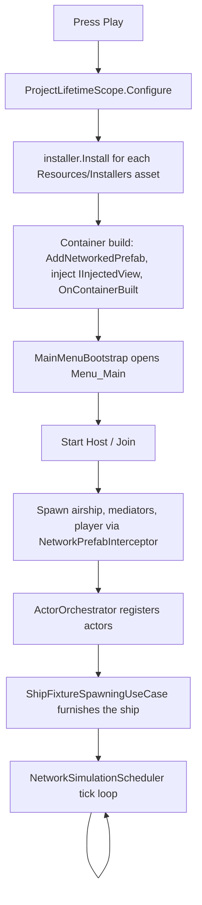

# Architecture Overview

The why behind the structure. For where things are, see [`CODE_MAP.md`](CODE_MAP.md); for how to build on it,
[`TUTORIAL_NEW_FEATURE.md`](TUTORIAL_NEW_FEATURE.md) and [`TASK_GUIDES.md`](TASK_GUIDES.md).

## Core Pillars

TinCan is built on a few technical pillars designed to make multiplayer development scalable and modular:

### 1. Dependency Injection (VContainer)
We use [VContainer](https://vcontainer.hadashikick.jp/) as our DI framework.
- **No Singletons:** Avoid using `Instance` patterns. Inject dependencies via constructors or standard VContainer `[Inject]` attributes on MonoBehaviours.
- **ProjectLifetimeScope:** Found in `App/ProjectLifetimeScope.cs`. This is the composition root where core services, registries and NGO services are bound, and where every `FeatureInstaller` asset is asked to register its feature.
- **Entry Points:** We heavily utilize `IInitializable`, `ITickable`, and UseCases bound via `builder.UseEntryPoints(...)`.
- **Constructor selection:** VContainer picks the constructor with the most parameters. A class with a test-only overload must mark the production constructor `[Inject]`.

### 2. Networking (Netcode for GameObjects - NGO)
All multiplayer synchronization runs through Unity's official Netcode for GameObjects.
- **Naming Convention:** All components that inherit from `NetworkBehaviour` MUST be suffixed with `NetworkMediator` (e.g., `AbilityNetworkMediator`, not `AbilityController`).
- **NetworkMediators:** MonoBehaviours that act as the authoritative bridge. Logic should be separated into pure C# `UseCase` or `Processor` classes, while the Mediator handles the RPCs and `NetworkVariables`.
- **Prefab Spawning:** Controlled strictly via VContainer's `AddNetworkedPrefab` extension, which pairs a prefab with a `NetworkPrefabInterceptor` so instances are injected on every peer before NGO's spawn callbacks. Core prefabs (player, airship, possession and build mediators) are wired in `ProjectLifetimeScope`; feature prefabs are listed by their installer.

### 3. Simulation & Synchronization Paradigms
To maintain a responsive FPS experience, we follow an **Input-Driven Simulation** paradigm:
- **Input-Driven Simulation (Input Sync):** Primary for movement and time-critical actions. Clients capture intent as an `InputState`. Both Client (Prediction) and Server (Authority) execute the same Use Case logic using this input stream.
  For humanoids the stream is exact, not "latest value". The owner stamps each tick's input with a sequence and sends
  it, with the previous three, in an unreliable RPC (`HumanoidPlayer.SubmitInputsServerRpc`). The server queues
  inputs in `Core/Humanoid/HumanoidInputBuffer.cs` and consumes exactly one per simulation tick
  (`HumanoidMovementUseCase.Tick` → `IBufferedInputSource.AdvanceInput`). A starved tick repeats the last input
  without its jump. An overfull queue skips its oldest inputs but keeps their one-shot bits. Plan:
  `.docs/plans/humanoid-prediction-reconciliation.md`.
- **Humanoid prediction and reconciliation:**
  - The owning client simulates its own player immediately and records each input with its predicted state
    (`HumanoidPredictionHistory`). Transform sync does not overwrite it (`NetworkTransformMediator.OwnerPredicted`).
  - After simulating each remote player's input the server sends that player's state back, unreliable, to the owner
    only (`HumanoidPlayer.ReceiveAuthoritativeStateClientRpc`).
  - The owner compares it with its prediction for the same input (`HumanoidReconciliationProcessor`). Within 2 cm
    it keeps its prediction. Otherwise `HumanoidMovementUseCase.RewindAndReplay` restores the server state and
    re-runs the unacknowledged inputs. On a teleport (`TeleportEpoch`, bumped by `ResetCharacter`) it snaps.
  - **Drawing is separate from simulation.** The player's root moves at the tick rate. Its `Visual` child is drawn
    by `HumanoidVisualSmoothingView`, interpolated between ticks in ship space, with replay corrections faded out.
    The camera follows the visual.
  - **Ship-local rule:** player state is always compared in the local space of the platform underfoot, and
    movement is simulated in that platform's yaw frame (input look and momentum). Each peer sees the ship at a
    different pose, so world-space comparison or world-space momentum desyncs on a moving or turning ship.
- **Decoupled Prediction Loop:** UseCases that own a simulation loop (e.g., `HumanoidMovementUseCase`) are strictly responsible for passing their predicted `InputState` to auxiliary systems (like `AbilitySystemUseCase.ProcessAbilitySimulation`). Global systems must check `actor is ISimulatedActor` and skip global ticking for actors that handle their own prediction, guaranteeing that simulation physics and abilities share the exact same temporal tick.
  GAS counts time in simulation ticks (`ITimeService.Tick`): effect durations, cooldowns and timing windows are authored in seconds and become whole ticks when applied (`Core/Gas/GameplayTicks.cs`), so owner and server end a window after the same number of ticks. Each actor has one ability controller and one clock: `ActorOrchestrator` registers one controller per `Id` (`AbilityControllerSelection`, the `ISimulatedActor` wins), and the global loop runs on the simulation tick (`ISimulationTickable`, `AfterHumanoid`), never per frame. Reconciliation replays movement only; GAS tags stay server-authoritative.
  Ability-to-ability rules live on `AbilityDefinition`: `CancelAbilitiesWithTag` ends the actor's matching active abilities when this one activates, `BlockAbilitiesWithTag` stops matching ones from activating while this one is active (matching is by `AbilityTag`, parents included), and `EndsImmediately` marks a one-shot ability that ends in its activation tick after applying its effects and cooldown.
  The current airship is a legacy exception: `Assets/Scripts/Core/Ship/AirshipMovementUseCase.cs` does not tick GAS. Its separate `Assets/Scripts/Network/Infrastructure/Abilities/AbilityNetworkMediator.cs` is not an `ISimulatedActor`, so `AbilitySystemUseCase.Tick` still updates that controller globally. Moving ship abilities into prediction requires changing both paths together to preserve one ticking owner.
- **State-Driven Synchronization (State Sync):** The server is the source of truth for high-level state changes (Tags, Attributes, Inventory). Mediators sync these back to clients via `NetworkVariable` or `ClientRpc` for visual confirmation.
  Persistent state replicates as state (`NetworkVariable`/`NetworkList`), never as change RPCs, so a late joiner receives it whole with the spawn. GAS tags follow this: `AbilityNetworkMediator` keeps a server-written `NetworkList` of tag names, and a client's `HasTag` combines it with the owner's predicted effect tags (`Core/Gas/ClientTagState.cs`). Clients never write tags: only the server and effects change them (there is no tag-request RPC). Every peer matches tags the same way: a held tag matches the query tag or any of its parents (`GameplayTag.IsChildOf`); clients resolve held names through `IGameplayTagRegistry`.
- **Avoid Side-Channels:** Do not use independent `ServerRpc` calls for actions that are part of the core simulation loop (like ability triggers or jumping). These should be bits in the `InputState` to ensure they are processed at the correct simulation tick.
- **Input is contexts, not keys** ([`INPUT.md`](INPUT.md)):
  - Keys live in one Input System asset that only `TinCan.Input` reads. Code names actions through typed
    `InputActionId`s, grouped into `InputContext`s.
  - A context is live while its condition holds (what you possess, a tag such as `State.Occupying.Cannon`, an open
    menu) and may silence other contexts. Only a live context's actions listen.
  - Continuous actions are read into the `InputState` by the system that owns the context. Discrete ones are routed
    to one `InputCommandHandler`, and the highest live context consumes the press.
  - A station that takes over the controls is a context (tag condition, silences the body) plus an
    `IHumanoidInputContributor` that writes its part of the predicted input (`StationAim`). It is still one input
    stream, predicted and tick-exact.
  - The generated [`INPUT_MAP.md`](INPUT_MAP.md) shows what listens to what.

- **Equipment grants abilities.** What a player holds is an `ItemDefinition` whose id the server writes into
  `EquipmentNetworkMediator`. The item carries its capabilities as data: an Infinite `EquippedEffect` whose tags say
  what is held (`State.Carrying.Net`), and `GrantedAbilities` (`GA_SwingNet`).
  - Ability grants are not replicated, so on each change `EquipmentAbilityBinder` applies them on the server
    (authority) and on the owning client (prediction), never on proxies.
  - It revokes exactly what it granted and leaves starting abilities alone.
  - An ability that needs a target (swing a net, repair a hull) only sets intent and a tag window. A feature use
    case on the server finds the target and performs the world effect (`NetCatchUseCase`).
  - Plan: `.docs/plans/ship-damage-repair.md`.

- **Gameplay cues are presentation; domain events are logic.** `IEventPublisher` events are server-local (logic,
  telemetry, tests) and never drive visuals. Sound, VFX and HUD feedback are **gameplay cues**:
  - **Identity:** a cue is a `Cue.*` gameplay tag. Gameplay logic never reads `Cue.*` tags (a convention, kept by
    review).
  - **Source:** effects declare cues (`GameplayEffectDefinition.Cues`), and the duration type picks the kind.
    - A Duration or Infinite effect puts its cue tags on the target while it is active. That makes a **state cue**:
      it replicates with the tags, reaches late joiners, and is predicted on the owner.
    - An Instant effect fires a **burst**: once on every peer, through an unreliable RPC on the target's
      `AbilityNetworkMediator`, never twice for a predicting owner. Late joiners miss bursts by design.
  - **Handlers:** what a cue does is composed. A feature contributes `GameplayCueNotify` assets (action lists:
    `SpawnPrefab`, `PlaySound`, `HudToast`) through `FeatureInstaller.IExtension<GameplayCueNotify>`. Components in the
    target's own hierarchy can implement `IGameplayCueHandler` (`ToggleObjectCueHandler`).
  - **Runtime:** `GameplayCuesFeatureInstaller`, in `Core/Gas/Cues/`. Plan: `.docs/plans/gameplay-cues.md`.

### 4. Possession & Interaction Flow
Possession decides what a player controls: their own body, or (a dev tool) the free camera. Crew jobs on the ship
(the helm, a cannon) are **stations**, not possession: the player stays in their body and view (`Features/Stations/`).
The helm steers the ship through its pilot seam, `Core/Ship/IAirshipPilotInput.cs` (`Features/Helm/`; plan
`.docs/plans/helm-station.md`).
The ship is kinematic, so nothing solid stops it by itself; a feature that finds it inside something pushes it out
through `Core/Ship/IAirshipCollisionResponse.cs` (the movement use case moves it and removes its velocity into the
surface). Sky islands do this on the server.
- **IPossessable is opt-in:** an object is possessable when it has a `PossessableNetworkMediator` (the replicated
  possessor; a player object is possessed by its owner on spawn). Its actor (`HumanoidPlayer`)
  implements `IPossessable` by forwarding to it. The local free camera is the only other possessable.
- **Possession authority:** `ServerPossessionManager` (`IPossessionAuthority`) assigns ownership on the server; `PossessionUseCase` (`IPossessionState`) is the client-side view; `PossessionNetworkMediator` carries the RPCs.
- **Interaction is targeting plus an input bit:**
  - Interact is a predicted input bit (`Input_Interact`). On the tick a player's simulated input first has it pressed,
    `InteractInputUseCase` (server) acquires the target with `TD_Interact` from that tick's pose. It then calls
    `InteractionOrchestrator.HandleInteraction(requester, target)`, which picks the `IInteractionHandler` named by the
    target's `InteractionDefinition`.
  - The owner's prompt (`InteractorControllerView.CurrentTarget`) runs the same query, so both agree and no client ever
    names a target.
  - Every `IInteractionTarget` is an `ITargetable` through default members.
  - This is the only interaction path; without `InteractionFeatureInstaller` nothing can be interacted with.

### 5. ECS-Lite & Orchestrated Registries
Instead of tight coupling and hardcoded subsystem checks, we utilize an ECS-lite compositional pattern based around Registries:
- **Registries as Queries:** Subsystems operate on generic sets of interfaces (e.g., `IInteractorRegistry`, `IAbilityRegistry`, `IActorRegistry`).
- **Entities:** every networked object has one `EntityNetworkMediator` on its root (`Core/Entities/`; a rule test
  enforces it). It is the object's identity and its only registrar:
  - **`EntityId`**, a GUID the server assigns (or a spawner presets, for a saved world) and replicates, so it is the same
    on every peer and for late joiners.
  - **Actor ids come from it** (`Core/Domain/Entities/ActorIdentity`): an actor on the root has the entity id, an actor
    on a child object an id derived from the entity id and its path (`EntityIds.Derive`). Components on one object share
    one id. Nothing else makes ids (`EntityIds.New` is the only `Guid.NewGuid`).
  - **Registration once:** in `OnNetworkPostSpawn` it calls `IActorOrchestrator.RegisterEntity`, which registers the
    root's primary actor (the `ISimulatedActor`, else the first), one ability controller per actor, the interactors and
    the targetables whose nearest entity is this one (a fixture parented under the ship is its own entity). Despawn
    unregisters them. Views and mediators never register themselves.
  - `IActorOrchestrator.Entities` (`IEntityRegistry`) lists the live entities: the seam for a later session layer and
    for persistence.
- **Ship membership:** fixtures such as `FuelTankNetworkMediator` link to their ship with `RegisterShipModule` /
  `UnregisterShipModule`; the orchestrator removes old membership on reparenting, while the fixture owns its local
  attribute binding.
- **Decoupled UseCases:** A `UseCase` iterates over its specific Registry, processing data without knowing if the actor is a Humanoid, an Airship, or an AI.

### 6. Targeting (cross-cutting)
"What is this actor aiming at?" has one answer, shared by features and GAS. Interaction, repair and (later) net catch,
build placement and weapons are *uses* of targeting, not separate aiming systems.
- **Contracts** (`Core/Domain/Targeting/`):
  - `ITargetable`: an aim point, `IsTargetable`, and an optional GAS controller for tag filters.
  - `ITargetableRegistry`.
  - `ITargeter` + `TargetingOrigin`: body pose, eye height, aim pitch and orbit height. A humanoid's eye height is
    `IHumanoidMovementView.EyeHeight` (tuned on the player prefab, measured from the root, which is the capsule centre).
- **Registration:** `ActorOrchestrator` registers every `ITargetable` in a spawned hierarchy, like interactors. It
  resolves the registry optionally, because the Targeting installer can be switched off.
- **Queries are data:** a `TargetingDefinition` (`Assets/Targeting/TD_*`) chooses an aim source (`BodyForward`,
  `BodyOffset`, `EyeAim`, `CameraAim`), a shape (`Cone` for forgiving close scans, `Sphere`, a physics `Ray`, `Look`), gameplay-tag filters on the
  target, a selection rule and optional line of sight. Several aim models coexist; each context picks its own.
  `AbilityDefinition.Targeting` links an ability to one. A caller can also pass an accept filter (Interact takes only
  `IInteractionTarget`s: `InteractionTargetingSettings.OnlyInteractable`).
- **Look is what the player looks at** (`TD_Interact`): a ray along the aim wins outright on the first accepted target
  it hits, whatever that target's pivot. Only if it hits none does a narrow cone take the best-aligned target, measured
  to the closest point of its colliders, not its pivot. Line of sight ignores the target's own colliders and the
  targeter's body. Plan: `.docs/plans/interaction-targeting.md`.
- **Authority:** `ITargetingService.TryAcquire` runs on any peer from simulated state: a humanoid aims from its body's
  position along its replicated look (yaw and pitch from the input, not the body, which eases toward the look). The
  owner uses it to predict; the server's answer is authoritative. The server never trusts a client-chosen target.
- **Projectile sweeps are targeting too:** `ITargetingService.TryAcquireSegment(from, to, definition, ignore)` sweeps
  one straight piece of a path (a cannonball's step this tick) with the definition's `Radius` and tag filters. The
  first accepted target or solid non-target collider ends it. Triggers, filtered-out targets and colliders the
  caller ignores (its own ship, players) are passed. Plan: `.docs/plans/cannon-and-hazards.md`.
- **Aim pitch travels in the input:** `HumanoidInputState.LookPitch`, in degrees, positive looks down. It is captured
  from the player's look and predicted, sent and replayed with the rest of the input. `EyeAim` (from the eye) and
  `CameraAim` (from the camera rig's aim height, `ILookView.AimHeight`: the orbit centre in third person, so rigging
  behind the player is never picked; the eye in first person) follow the pitched aim.
  A cone's vertical angle is centred on it; `BodyForward` stays level. The roadmap is in
  `.docs/plans/targeting-subsystem.md`.

### 7. Feature composition
A feature is one folder under `Assets/Scripts/Features/` with its own assembly (`TinCan.Features.<Name>`), plus one
`FeatureInstaller` asset under `Assets/Resources/Installers/`. The assembly is the feature's boundary, enforced by
the compiler:
- it sees only the core and the features it references;
- core can't see it;
- a reference to another feature is a requirement every profile loading it must meet.

The core systems are assemblies too, in a fixed one-way order:

`Core.Domain` → `Targeting`, `Possession`, `Entities` → `Gas` → `Humanoid` → `Interaction` → `Ship` → `Items`, `UI`

A contract two core systems share goes down into `Core.Domain`, never sideways.

The rule is in [CODE_MAP.md, "Assemblies and the one-way rule"](CODE_MAP.md#assemblies-and-the-one-way-rule);
`GasChallenge` is the worked example. The installer registers the feature's services, lists the networked prefabs it
spawns and the fixtures it bolts onto the ship. Adding a feature touches no shared file. `ProjectLifetimeScope`
registers only the core: networking, time, registries and entities, possession (with `ILocalViewCamera`), abilities,
input, the humanoid and airship simulations and their scheduler, interaction core, and spawning (which moves to a
session layer later). Every other feature is an installer, switched on per scene by its profile. Reference:
[`FEATURE_INSTALLERS.md`](FEATURE_INSTALLERS.md).

A left-out feature must be absent, never half-present. Shared prefabs (player, airship) hold core components and
sockets only. Features plug in through ship fixtures and `ActorAbilityGrant`s, or grant at runtime from their own use
case. A feature component that must sit on a shared root resolves its services optionally. At configuration the
scope checks that every installed service's dependencies are registered, and refuses to start if not
(`InstallerServiceCheck`). Rule tests enforce both per prefab and per profile; see
[Features and shared prefabs](FEATURE_INSTALLERS.md#features-and-shared-prefabs).

**Play sessions pace features without knowing them.** The Voyage feature (a voyage to a destination, won or lost,
then Restart) never references the features it paces. Any feature with state to restore, or pressure to switch,
registers `.As<ISessionParticipant>()` (`Core/Domain/ISessionParticipant.cs`):
- `ResetForSession()` restores the start state;
- `SetSessionActive(bool)` switches the pressure on (underway) or off (briefing, end screen).

Today these are sky hazards, ship damage, fuel and the designed-events director. In a scene without Voyage, nothing
calls them and features keep their defaults. Plan: [plans/voyage-session.md](plans/voyage-session.md).

The session also carries a **layout** every peer can read, `ISessionLayout` (`Core/Domain/ISessionLayout.cs`): a seed the
server rolls when a voyage begins, its start and its destination, replicated by the voyage state. A feature that
generates the world per voyage (sky islands) builds from it on every peer, so the world itself is never replicated.
Without a voyage the seed is 0 and such features fall back to their own. Plan: [plans/sky-islands.md](plans/sky-islands.md).

**Ships can be built from a design** (`Features/ShipDesigns/`). A `ShipDesign` is plain data: parts on a 1 m grid,
each with a stable instance id, a part id and an orientation. It is saved as versioned JSON and sent as a compact binary
form. Parts are `ShipPartDefinition` assets that features contribute, as they contribute fixtures. The server gives each
ship a validated design. The ShipDesignState fixture replicates it, and every peer builds the structure locally, as sky
islands do. Functional parts (the helm) are spawned by the server as networked fixtures at their design pose. A design
that places a part keeps the same prefab's installer fixture off the ship (`Core/Ship/Fixtures/IShipFixtureFilter.cs`).
A design's parts carry mass, lift, thrust and hull; the server turns them into the ship's speed, turn rate and health
through `Core/Ship/IAirshipTuning.cs`. The shipyard (`Features/Shipyard/`) builds designs offline.
Plan: [plans/modular-airship-builder.md](plans/modular-airship-builder.md).

## A Play session, end to end

What happens between pressing Play and the first simulation tick.

1. The scene loads. It is nearly empty; `GameLifetimeScope.prefab` carries the `ProjectLifetimeScope` and the
   UI overlays.
2. `ProjectLifetimeScope.Configure` runs: it loads every installer from `Resources/Installers`
   (`FeatureInstallerCatalog`), registers core services, processors and registries, calls `Install(builder)` on
   each installer in `Order`, then declares entry points.
3. The container builds. In the build callback the scope pairs each networked prefab (core ones from its own
   fields, feature ones from the installers) with a `NetworkPrefabInterceptor`, injects every scene
   `IInjectedView` (the menu and HUD overlays), and calls `OnContainerBuilt` on each installer.
4. `MainMenuBootstrap` opens the main menu because the network state is Offline.
5. **Start Host.** `NGONetworkService` starts NGO. On `OnServerStarted` the airship, possession and build
   mediators are instantiated, injected and spawned. On client connect `NetworkPlayerSpawner` spawns the player.
   On every peer the interceptor injects the instance before NGO's `OnNetworkSpawn`, and the mediator's
   `OnNetworkSpawn` hands its hierarchy to `ActorOrchestrator`, which fills the registries.
6. `ShipFixtureSpawningUseCase` (server) sees a new `IAirshipView` and spawns every `ShipFixtureDefinition`
   from the installers as a child `NetworkObject` of the ship.
7. `NetworkSimulationScheduler` subscribes to the network tick and, every tick, runs:
   airship movement, `AfterAirship` feature tickables, `BeforeHumanoid` feature tickables (cloud boundary), `Physics.SyncTransforms`, humanoid
   movement, `AfterHumanoid` feature tickables. Per-frame work (`ITickable`) runs from VContainer's player loop
   outside this order.

```mermaid
flowchart TD
    Play[Press Play] --> Cfg[ProjectLifetimeScope.Configure]
    Cfg --> Inst[installer.Install for each Resources/Installers asset]
    Inst --> Build[Container build: AddNetworkedPrefab, inject IInjectedView, OnContainerBuilt]
    Build --> Menu[MainMenuBootstrap opens Menu_Main]
    Menu --> Host[Start Host / Join]
    Host --> Spawn[Spawn airship, mediators, player via NetworkPrefabInterceptor]
    Spawn --> Reg[ActorOrchestrator registers actors]
    Reg --> Fix[ShipFixtureSpawningUseCase furnishes the ship]
    Fix --> Tick[NetworkSimulationScheduler tick loop]
    Tick --> Tick
```

The host/server/client sequence in detail is in [`Network_Initialization_Flow.md`](Network_Initialization_Flow.md).

## Feature guides

- [`FEATURE_INSTALLERS.md`](./FEATURE_INSTALLERS.md): how a feature registers itself (one `FeatureInstaller` asset), spawns its networked prefabs, contributes ship fixtures, and runs on the network tick without touching shared files.
- [`UI_FRAMEWORK.md`](./UI_FRAMEWORK.md): data-driven menus (`MenuDefinition`), the headless `IMenuSystem` / `IMenuCommand` / `IHudValues` API, Cancel-key ownership, and how to add menus, commands and HUD values.

## Extensibility Points

When adding a new feature (like a new vehicle or weapon):
1. Create pure C# domain logic (e.g., `GunShootingProcessor`) and test it.
2. Create a `UseCase` (`ITickable` or `ISimulationTickable`) to bind input and trigger the logic.
3. If it needs networking, create a `WeaponNetworkMediator` (`NetworkBehaviour`) and attach it to the prefab.
4. Register everything in a `FeatureInstaller` subclass and create its asset under `Assets/Resources/Installers/`.
   Binding in `ProjectLifetimeScope` is legacy; do not add to it.

The full walkthrough is [`TUTORIAL_NEW_FEATURE.md`](TUTORIAL_NEW_FEATURE.md).
