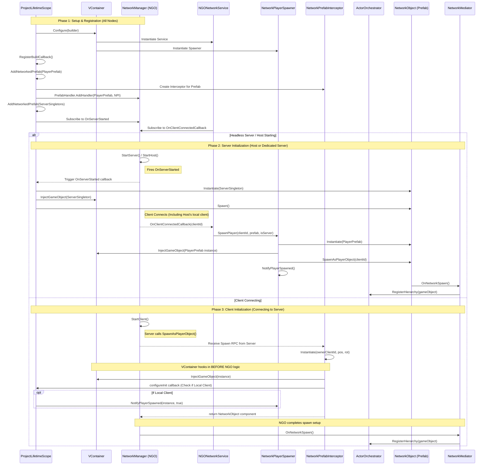

# Network Initialization Flow

This diagram illustrates how VContainer dependency injection integrates with Netcode for GameObjects (NGO) during the initialization of networked components across different network topologies (Host, Dedicated Server, and Client).

