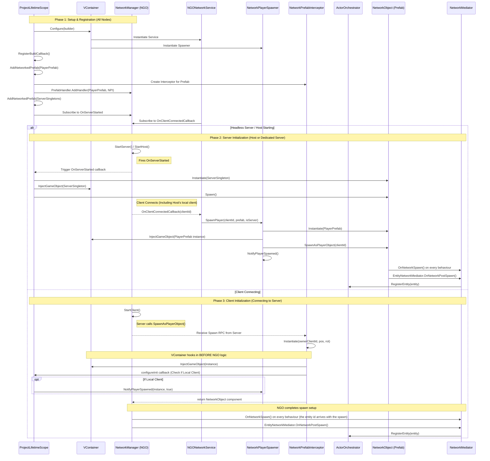

# Network Initialization Flow

This diagram illustrates how VContainer dependency injection integrates with Netcode for GameObjects (NGO) during the initialization of networked components across different network topologies (Host, Dedicated Server, and Client).

```mermaid
sequenceDiagram
    participant LS as ProjectLifetimeScope
    participant VC as VContainer
    participant NM as NetworkManager (NGO)
    participant NS as NGONetworkService
    participant NPS as NetworkPlayerSpawner
    participant NPI as NetworkPrefabInterceptor
    participant AO as ActorOrchestrator
    participant NO as NetworkObject (Prefab)
    participant NMd as NetworkMediator

    Note over LS, NM: Phase 1: Setup & Registration (All Nodes)
    LS->>VC: Configure(builder)
    VC->>NS: Instantiate Service
    VC->>NPS: Instantiate Spawner

    LS->>LS: RegisterBuildCallback()
    LS->>LS: AddNetworkedPrefab(PlayerPrefab)
    LS->>NPI: Create Interceptor for Prefab
    LS->>NM: PrefabHandler.AddHandler(PlayerPrefab, NPI)

    LS->>LS: AddNetworkedPrefab(ServerSingletons)
    LS->>NM: Subscribe to OnServerStarted

    NS->>NM: Subscribe to OnClientConnectedCallback

    alt Headless Server / Host Starting
        Note over LS, NMd: Phase 2: Server Initialization (Host or Dedicated Server)
        NM->>NM: StartServer() / StartHost()

        Note right of NM: Fires OnServerStarted
        NM-->>LS: Trigger OnServerStarted callback
        LS->>NO: Instantiate(ServerSingleton)
        LS->>VC: InjectGameObject(ServerSingleton)
        LS->>NO: Spawn()

        Note right of NM: Client Connects (Including Host's local client)
        NM-->>NS: OnClientConnectedCallback(clientId)
        NS->>NPS: SpawnPlayer(clientId, prefab, isServer)

        NPS->>NO: Instantiate(PlayerPrefab)
        NPS->>VC: InjectGameObject(PlayerPrefab instance)
        NPS->>NO: SpawnAsPlayerObject(clientId)
        NPS->>NPS: NotifyPlayerSpawned()

        NO->>NMd: OnNetworkSpawn() on every behaviour
        NO->>NMd: EntityNetworkMediator.OnNetworkPostSpawn()
        NMd->>AO: RegisterEntity(entity)

    else Client Connecting
        Note over LS, NMd: Phase 3: Client Initialization (Connecting to Server)
        NM->>NM: StartClient()

        Note right of NM: Server calls SpawnAsPlayerObject()
        NM-->>NPI: Receive Spawn RPC from Server
        NPI->>NPI: Instantiate(ownerClientId, pos, rot)

        Note over NPI, VC: VContainer hooks in BEFORE NGO logic
        NPI->>VC: InjectGameObject(instance)
        NPI->>LS: configureInit callback (Check if Local Client)

        opt If Local Client
            LS->>NPS: NotifyPlayerSpawned(instance, true)
        end

        NPI-->>NM: return NetworkObject component

        Note over NM, NMd: NGO completes spawn setup
        NM->>NMd: OnNetworkSpawn() on every behaviour (the entity id arrives with the spawn)
        NM->>NMd: EntityNetworkMediator.OnNetworkPostSpawn()
        NMd->>AO: RegisterEntity(entity)
    end
```

## Starting a session

| Mode | How | Listens on | Local player |
|---|---|---|---|
| Host (listen server) | Host button, or `-autohost` | the transport's `ServerListenAddress`:`Port` on `NetworkService.prefab` or its scene instance (tick **Allow Remote Connections** for `0.0.0.0`) | yes |
| Dedicated server | `-server [address][:port]` (default `0.0.0.0:7777`) | that endpoint, set through `INetworkService.SetListenEndpoint` and forced over NGO's own `-port` / `-ip` overrides | no |
| Client | Join menu, or `-autojoin [address[:port]]` (default `127.0.0.1:7777`) | n/a | yes |

The flags are parsed by `Core/UI/CommandLineSessionBootstrap.cs`. `0.0.0.0` accepts players from other machines;
`127.0.0.1` only from this one. The transport is UDP: allow the port through the host's firewall for LAN play.

A dedicated server spawns the ship on server start and a player per connecting client, so a voyage waits in Idle
until someone is aboard and joiners start on the ship's deck ([`plans/crew-gate-and-boarding.md`](plans/crew-gate-and-boarding.md)).
The Linux build and its container: [`plans/dedicated-server-container.md`](plans/dedicated-server-container.md),
`.tools/build.ps1`, `Container/server/` (Podman).
